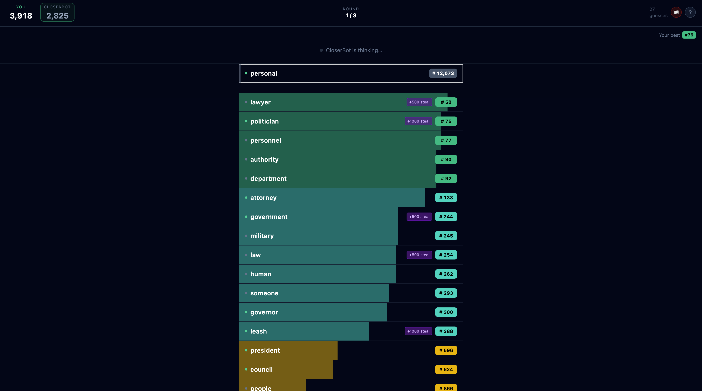

# Proximo

A real-time, two-player word duel. There's a hidden target word; you and your
opponent take turns guessing, and every guess is ranked by how close it is to
the target **in meaning** — rank #1 is the word itself, #25,000 is completely
unrelated. Land the exact word to end the round. Best of three, highest score
wins.

**Play it:** https://proximo-nine.vercel.app — no login, works on phones.
Hit **Quick Match** to get paired with whoever's online; if nobody shows up
within 20 seconds, CloserBot steps in.



## How the ranking works

There is no AI inference at play time.

1. A curated dictionary of **25,000 common English words** (frequency-ordered,
   proper nouns and junk filtered out via WordNet + the NLTK names corpus) and
   a pool of **3,000 target words**.
2. One offline job embeds every dictionary word with
   [`sentence-transformers/all-MiniLM-L6-v2`](https://huggingface.co/sentence-transformers/all-MiniLM-L6-v2),
   then for each target sorts the entire dictionary by cosine similarity into
   a `{word → rank}` table (~450 KB of JSON per target, ~1.1 GB total).
3. The tables live in Cloudflare R2. At runtime, scoring a guess is a JSON
   fetch (LRU-cached) plus a hash-map lookup.

Score per guess is `25,000 ÷ rank`, so a rank-#50 guess is worth 500 points
and the kill is worth 25,000 — whoever finds the word usually takes the round,
but bonuses for "steals" (beating the best rank on the board) keep the race
interesting on the way down.

## The bot

CloserBot doesn't call a language model either. It plays directly off the same
rank tables: it opens vague, converges multiplicatively with deliberate
plateaus and misses, sometimes riffs off *your* best word, and only goes for
the kill once it's genuinely close. To keep its vocabulary human, it searches
a window around its intended rank and picks the most *common* word there
(the dictionary is frequency-ordered) — so it says "beach", not "boardwalk".
Thinking delays are context-aware: quick openings, longer stares in the
endgame.

## Architecture

```
Browser ── WebSocket ──> Fastify server (single instance, in-memory sessions)
                             │
                             ├── game engine (pure functions: ranks, scores, bonuses)
                             ├── matchmaking (one waiting slot + bot-fallback timer)
                             └── rank tables ── Cloudflare R2 (precomputed offline)
```

The server is fully authoritative: it holds the secret word, validates turns,
and broadcasts identical state to both clients. The frontend (React + Vite +
Tailwind) is a thin renderer. Hints — the one optional LLM feature — are
generated by Claude on request, with the target word structurally banned from
the output.

## Stack

React · TypeScript · Vite · Tailwind · Fastify · WebSockets · Zod ·
sentence-transformers (offline) · Cloudflare R2 · Vercel · Railway

## Run it locally

```bash
pnpm install
pnpm dev          # web on :3000, server on :3001

# quick bot iteration (bot joins in 2s, thinks fast):
QUICK_MATCH_BOT_DELAY_MS=2000 BOT_DELAY_MIN_MS=400 BOT_DELAY_MAX_MS=1000 pnpm dev
```

The repo does not ship the 1.1 GB of rank tables. Generate them once (about a
minute on Apple Silicon):

```bash
cd packages/embeddings && python -m venv .venv && .venv/bin/pip install -r requirements.txt && cd ../..
packages/embeddings/.venv/bin/python packages/embeddings/scripts/curate-words.py
packages/embeddings/.venv/bin/python packages/embeddings/scripts/precompute.py
```

Tests (`pnpm test`) cover the bot's guess-selection algorithm and the
matchmaking state machine; `apps/server/e2e-check.mjs` plays a full bot match
over a real WebSocket.
